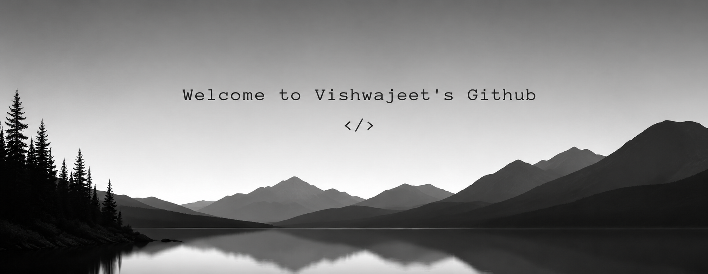

  

  
  
  
  

 

<h2 align="center"> <em> About me </em></h2>

<table>
<tr>
<td width="70%" valign="middle">

Hello there! <em><b>I'm Vishwajeet Deshmukh</b></em>, a BTech CSE student. I enjoy learning new technologies and solving problems in Python and applied ML. Right now I'm working on a few web and AI projects to put my Django, TensorFlow, and React skills into practice.

 

<em><b>Studying BTech in Computer Science &amp; Engineering</b></em> 
<em><b>Building SmartAgri, Alpha Robot Companion &amp; ExpensesPro</b></em> 
<em><b>Learning Django &amp; Machine Learning</b></em> 
<em><b>Founder at Vishv Technologies</b></em> 

</td>
<td width="30%" align="center" valign="middle">

</td>
</tr>
</table>

 

<h2 align="center"> <em> Technologies </em> </h2>

  
  
  
  
  
  
  
   
  
  
  
  
  
  
   
  
  
  
  

 

<h2 align="center"><em> Statistics </em> </h2>

  

